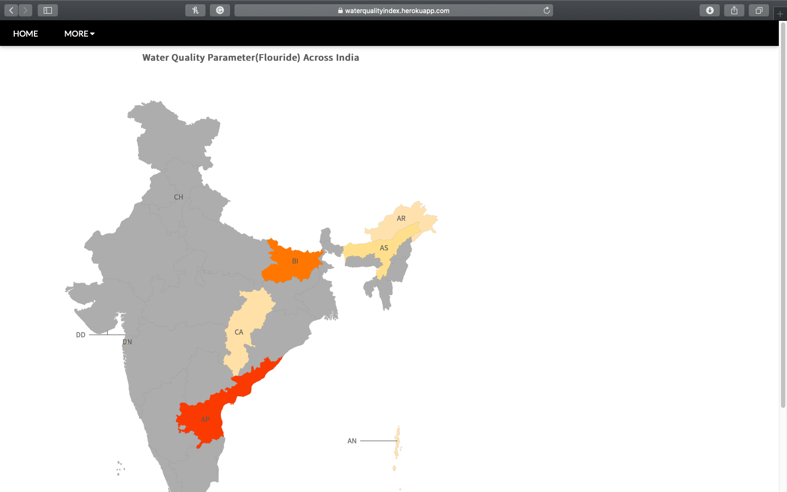
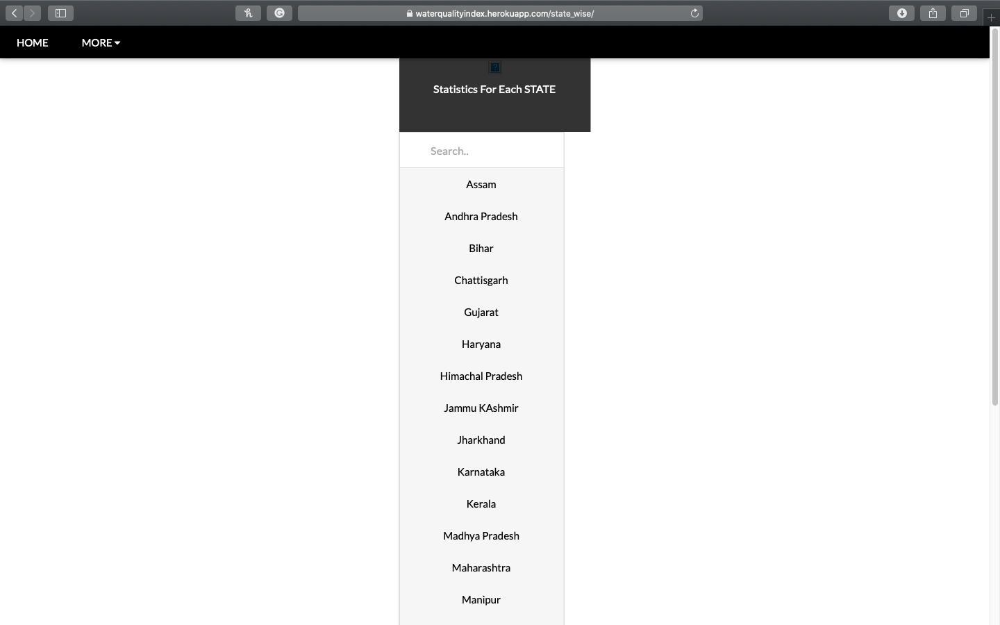
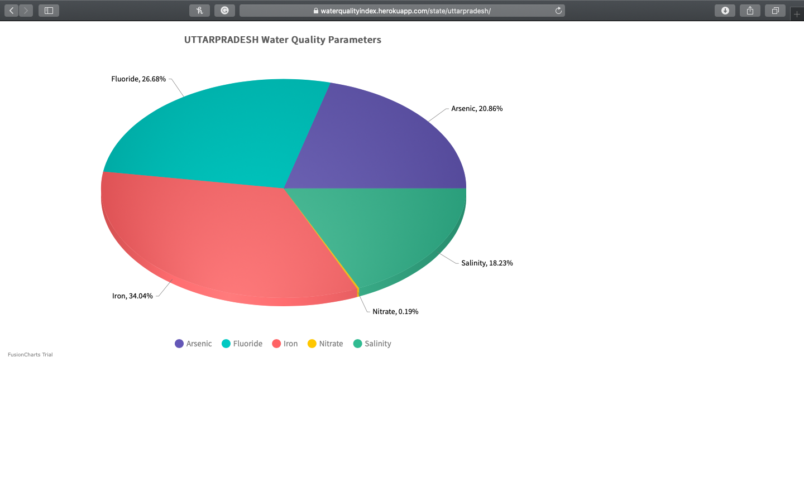

[](https://python.org)
[](https://djangoproject.com)

# Water-Quality-Analysis

This project provides statistical information about water indicex of all the indian states. This information can be proved to be valuable in analysis of water quality of an individual state. The dataset used has been included in the project

## Live Demo - http://waterqualityindex.herokuapp.com/

## Running the Project Locally

1. First, clone the repository to your local machine:

```bash
git clone https://github.com/nikhilarora068/Water-Quality-Analysis.git
```

2. Install the requirements:

```bash
pip install -r requirements.txt
```

3. Apply the migrations:

```bash
python manage.py migrate
```

4. Collect the Static folder files:

```bash
python manage.py collectstatic
```

5. Finally, run the development server:

```bash
python manage.py runserver
```

# Some Snippets of the running project 

## HOME PAGE



## Search PAGE



## Individual State Index PAGE



